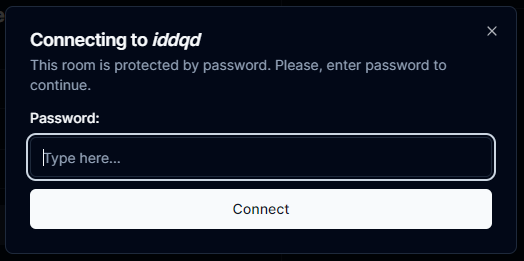

# TIC-TAC-TOE

*Tic-tac-toe* is a web application, built using Next.js (with custom server) and library Socket.io.

**Fast travel**:

- [TIC-TAC-TOE](#tic-tac-toe)
  - [Techstack](#techstack)
  - [Features](#features)
    - [Registration](#registration)
    - [Creating, joining and leaving lobby](#creating-joining-and-leaving-lobby)
    - [Game Room (Lobby)](#game-room-lobby)

---

## Techstack

**Primary:**

- Next.js (app router, 14.2.1);
- Express.js (^4.19.2);
- Socket.io (^4.7.5);
- shadcn/ui;
- React (^18);
- Redux-Toolkit;
- bcryptjs;
- body-parser;

**Secondary:**

- Tailwind;
- Framer-motion;
- Zod;
- react-transition-group;
- nodemon;
- react-icons;
- tailwind-merge;
- axios;

---

## Features

### Registration

User must provide a username (no need to be unique) to connect to game server. After submitting username, user will be informed whether the connection was successfully established or not.

By submitting user will receive unique private `sessionID` (which will be stored in localStorage) and public `userID`. All these params generates a server and saves inside [sessionStore.js](<server/store/sessionStore.js>).

In case of connection interruption - user will be automatically reconnected using `sessionID`.

### Creating, joining and leaving lobby

- *Creating a room*
User can create the game lobby (public / private). All data about room will be store inside [roomStore.js](<server/store/roomStore.js>). The password will be hashed and saved in encrypted form. After successful creation - user will be forwarded to new page with URL params: `roomname` and `password` (*url-example: /new-game/game-room?roomname=Test%20room&?password=$2a$10$JUPF4coInbQlsuIZugtNNu3Gm3fFCx8OdoHvOlrdUSL.pfqaXtXd6*).

```js
/**
 * @typedef {Object} Participator
 * @property {string} username - The username of the participator.
 * @property {string} userID - The userID of the participator.
 */

/**
 * @typedef {Object} Room
 * @property {string} roomname - The name of the room.
 * @property {string} password - The password for the room.
 * @property {number[][]} gameState - The game state of the room.
 * @property {Participator[]} participators - The list of participators in the room.
 * @property {string|null} x - The X role of the participator (contains userID).
 * @property {string|null} o - The O role of the participator (contains userID).
 * @property {string|null} whoseTurn - Indicates whose turn it is (contains userID).
 * @property {string|null} winner - Indicates userID of the winner (contains username).
 * @property {Participator[]} rematchVotes - Indicates array of participators with agreement to rematch.
 */
 ```

- *Joining the room*
User has several options to join the lobby (room):
  - use filter inside lobby table;
  - use the direct link of the lobby, provided by friend.

In case joining using lobby table user will be going to need a password.



- *Leaving the room*
There are options how user can leave room:
  - By pressing the `Leave game` button;
  - By leaving the page (via browser buttons `->` `<-` (*popstate event*) / by pressing navlink or another href).

If user refreshes the page, app will automatically reconnect him back to lobby.

### Game Room (Lobby)

Game room consists of four parts:

- Room control bar:
  - special panel where user can get information about room participators, name, choose role to play ('X' / 'O' / 'no role') or vote for a rematch.
- Game field:
  - area filled with squares (default field size = 3x3).
- Chat area:
  - place where participators can chat and get information about online status. Also chat notifies user about joining and leaving other users.
- Abandon button:
  - button which let user leave the room.
